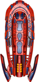
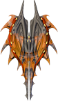

[![Contributors][contributors-shield]][contributors-url]
[![Forks][forks-shield]][forks-url]
[![Stargazers][stars-shield]][stars-url]
[![Issues][issues-shield]][issues-url]
[![LinkedIn][linkedin-shield2]][linkedin-url2]
[![Hireable][hireable]][hireable-url]

<!-- PROJECT LOGO -->
<br />
<p align="center">
  <h2 align="center"> Space Shooter Game</h2>

  <p align="center">
    In this project I implemented a shooter game with phaser, javascript modules and classes, webpack and jest
    <br />
    <a href="https://github.com/YairFernando67/SpaceShooter"><strong>Explore the docs »</strong></a>
    <br />
    <br />
    <a href="https://github.com/YairFernando67/SpaceShooter">View Demo</a>
    ·
    <a href="https://github.com/YairFernando67/SpaceShooter/issues">Report Bug</a>
    ·
    <a href="https://github.com/YairFernando67/SpaceShooter/issues">Request Feature</a>
    .
  </p>
</p>
<br/>
<a target="_blank" href="https://spaceshooterwar.herokuapp.com/">Live Version Here</a>


<!-- TABLE OF CONTENTS -->
## Table of Contents

* [About the Project](#about-the-project)
  * [Built With](#built-with)
* [Local installation](#Local-installation)
* [Contact](#contact)
* [Contributing](#Contributing)
* [Show your support](#Show-your-support)


<!-- ABOUT THE PROJECT -->
## About The Project

Space shooter game that includes a leaderboard for player's scores and options to enable or disable the audio.


### Built With
The project was developed using these tools and technologies.
* [CSS3](https://developer.mozilla.org/en-US/docs/Web/CSS)
* [HTML5](https://www.w3schools.com/html/)
* [Webpack](https://webpack.js.org/)
* [JavaScript](https://developer.mozilla.org/es/docs/Web/JavaScript)
* [Phaser](https://phaser.io/)


## Local installation


<p>Follow these steps:</p>

Clone the Repository

```Shell
user@pc:~$ git clone https://github.com/YairFernando67/SpaceShooter
```

Click on the console and to go to the folder that was created

```Shell
user@pc:~$ cd SpaceShooter
```

```
user@pc:~$ npm install or yarn install
```

```
user@pc:~$ npm run server
```

# Spaceships
---

### PLAYER


### ENEMIES


---
<br/>



---
<br/>




Open your browser on [http://localhost:3000](http://localhost:3000)

## Commands

- Move Left: Left Arrow Key
- Move Right: Right Arrow Key
- Move Up: Up Arrow Key
- Move Down: Down Arrow Key
- Show: SpaceBar


## Run Tests with Jest
```Shell
user@pc:~$ npm run test
```


<!-- CONTACT -->
## Contact

👤 **Yair Fernando Facio**


- Github: [@YairFernando67](https://github.com/YairFernando67)
- Twitter: [@yairfernandof](https://twitter.com/yairfernandof)
- Linkedin: [softwaredeveloperyairfacio](https://www.linkedin.com/in/softwaredeveloperyairfacio/)
- Email: [yair.facio11@gmail.com](https://mail.google.com/mail/?view=cm&fs=1&tf=1&to=yair.facio11@gmail.com)
- Portfolio: [softwaredeveloper](https://yairfernando.herokuapp.com/)

<p align="center">

Project Link: [https://github.com/YairFernando67/SpaceShooter](https://github.com/YairFernando67/SpaceShooter)

</p>

## 🤝 Contributing

Contributions, issues and feature requests are welcome!

Feel free to check the [issues page](https://github.com/YairFernando67/SpaceShooter/issues).

## Show your support

Give a ⭐️ if you like this project!

<!-- MARKDOWN LINKS & IMAGES -->

[contributors-shield]: https://img.shields.io/github/contributors/YairFernando67/SpaceShooter.svg?style=flat-square
[contributors-url]: https://github.com/YairFernando67/SpaceShooter/graphs/contributors
[forks-shield]: https://img.shields.io/github/forks/YairFernando67/SpaceShooter.svg?style=flat-square
[forks-url]: https://github.com/YairFernando67/SpaceShooter/network/members
[stars-shield]: https://img.shields.io/github/stars/YairFernando67/SpaceShooter.svg?style=flat-square
[stars-url]: https://github.com/YairFernando67/SpaceShooter/stargazers
[issues-shield]: https://img.shields.io/github/issues/YairFernando67/SpaceShooter.svg?style=flat-square
[issues-url]: https://github.com/YairFernando67/SpaceShooter/issues
[license-shield]: https://img.shields.io/github/license/YairFernando67/SpaceShooter.svg?style=flat-square
[license-url]: https://github.com/YairFernando67/SpaceShooter/blob/master/LICENSE.txt
[linkedin-shield2]: https://img.shields.io/badge/-LinkedIn-black.svg?style=flat-square&logo=linkedin&colorB=555
[linkedin-url2]: https://www.linkedin.com/in/softwaredeveloperyairfacio/
[hireable]: https://cdn.rawgit.com/hiendv/hireable/master/styles/flat/yes.svg
[hireable-url]: https://www.linkedin.com/in/softwaredeveloperyairfacio/


